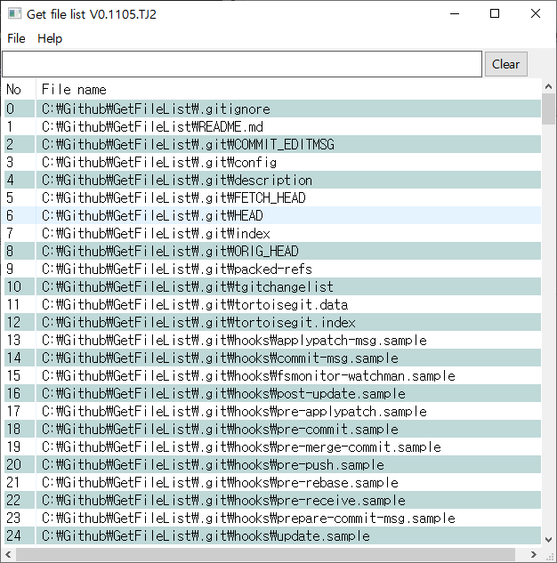

# GetFileList

# How to use  
## **Drag & Drop folder**

Filter all files include 'Hello' or 'world'
> Hello|world  

Filter all files include 'Hello' and 'world'
> Hello&world  

Open file
> Mouse Right Click

Copy the selected filename
> Ctrl + C

Open folder of selected file
> Ctrl + D

Toggle show/hide file path
> Ctrl + H

Open Notepad
> Ctrl + M

Open MsPaint
> Ctrl + P

Quit
> Ctrl + Q

## License
Copy Left
